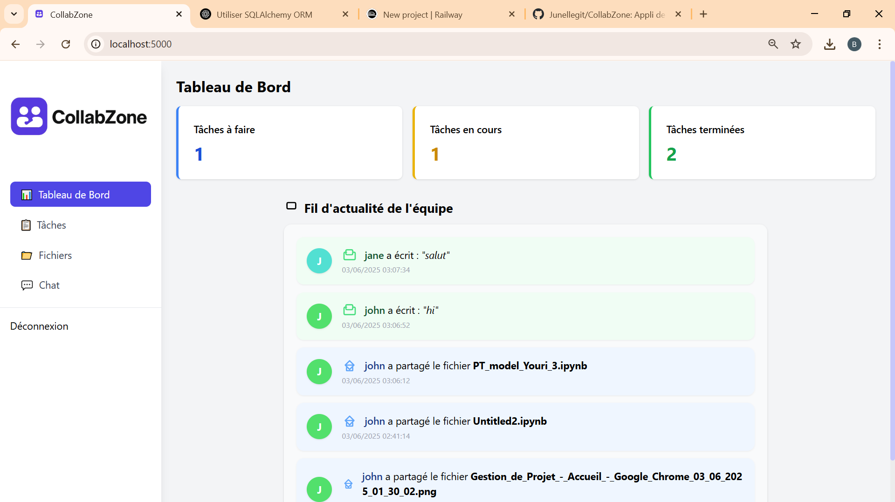

# CollabZone

Une application web de gestion de projets collaboratifs, simple, rapide et moderne, pour les équipes scolaires et professionnelles.

---

## 🚀 Fonctionnalités principales

- **Gestion visuelle des tâches** : Kanban drag & drop (Trello-like)
- **Chat d’équipe en temps réel** : système de messagerie instantanée
- **Partage de fichiers** : upload simple, interface centrée, aperçu des fichiers partagés
- **Tableau de bord** : suivi statistique et fil d’actualité (feed) de l’équipe (fichiers, messages…)
- **Notifications flottantes** : toast en temps réel lors des actions importantes
- **Interface responsive et moderne** : design épuré (TailwindCSS), avatars, icônes, couleurs douces

---

## 🖥️ Aperçu



---

## 🛠️ Tech Stack

- **Python 3 / Flask**
- **Flask-SocketIO** (chat temps réel)
- **Flask-SQLAlchemy** (base de données SQLite ou MySQL/PostgreSQL)
- **TailwindCSS** (frontend rapide, responsive)
- **Javascript natif** (drag & drop, toast, etc.)
- **HTML5/CSS3**

---

## ⚡ Installation locale

1. **Cloner le projet**
    ```bash
    git clone https://github.com/ton-user/collabzone.git
    cd collabzone
    ```

2. **Installer les dépendances**
    ```bash
    python -m venv venv
    source venv/bin/activate      # ou venv\Scripts\activate sur Windows
    pip install -r requirements.txt
    ```

3. **Lancer l’app**
    ```bash
    flask run    # ou python app.py
    ```

4. Ouvre [http://localhost:5000](http://localhost:5000) dans ton navigateur.

---

## ☁️ Déploiement rapide

- **Render.com**
    - Pousse sur GitHub, relie à Render, build auto :  
      Build command : `pip install -r requirements.txt`  
      Start command : `gunicorn app:app`
    - [Voir tuto Render](https://render.com/docs/deploy-flask)

- **Railway.app**
    - Déploie depuis GitHub, commande de lancement identique.

- **VPS / Nginx / Gunicorn**
    - Pour usage avancé, voir guide Flask production.

---

## 📦 Structure du projet

